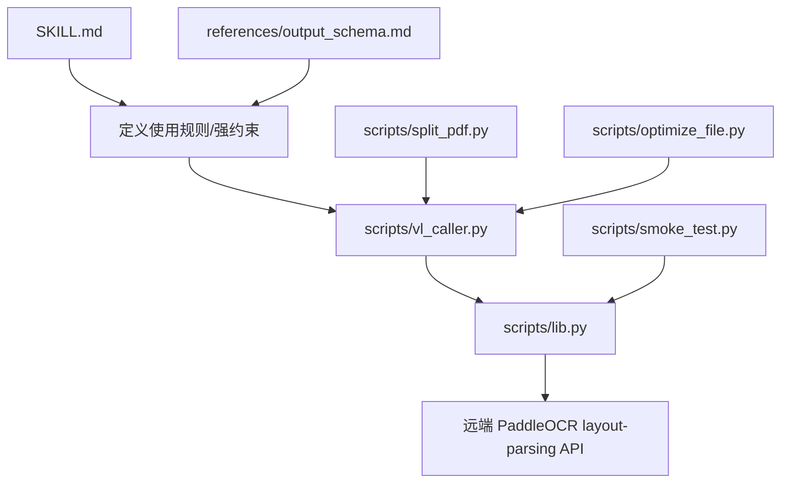
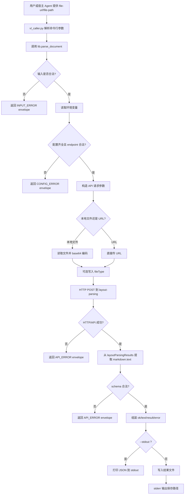
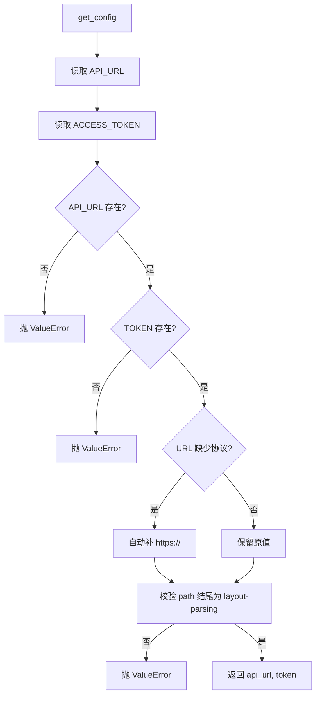
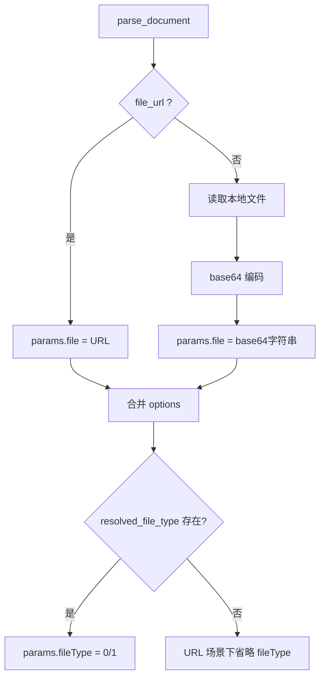
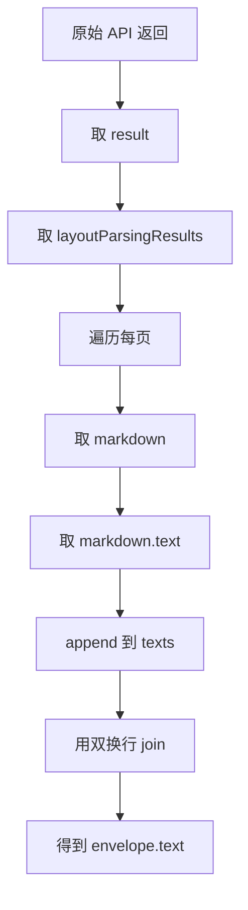
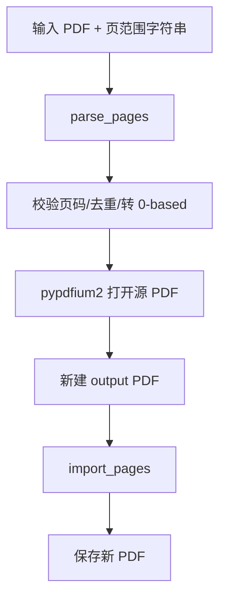
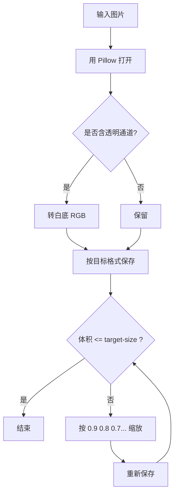

# PaddleOCR Doc Parsing Skill 分析报告

## 1. 结论先行

这个 Skill 的底层逻辑并不复杂，它本质上不是“文档解析引擎”，而是一个**对 PaddleOCR Document Parsing API 的严格封装层**。

它做的事情只有四类：

1. 校验运行环境和输入。
2. 把本地文件或 URL 转成 API 需要的请求参数。
3. 调用远端 `layout-parsing` 接口。
4. 把原始返回包装成稳定的统一输出结构，供宿主 Agent 消费。

所以它的真实功能边界很明确：

- **它不做本地 OCR**
- **它不做本地版面分析**
- **它不做结果二次理解**
- **它只负责“请求远端模型 + 统一返回格式 + 提供辅助预处理工具”**

## 2. 分析方法

按第一性原理拆解，这个 Skill 可以还原为几个不可再分的事实：

### 2.1 已验证事实

- 真正的解析动作来自远端 PaddleOCR API，而不是本地脚本。
- 主入口是 [`SKILL.md`](/Users/youjiangbin/IT_road/super-agent-desktop/packages/skills/paddleocr-doc-parsing/SKILL.md) 指定的 `python scripts/vl_caller.py`。
- 真正的业务逻辑集中在 [`scripts/lib.py`](/Users/youjiangbin/IT_road/super-agent-desktop/packages/skills/paddleocr-doc-parsing/scripts/lib.py)。
- `vl_caller.py` 只是一层 CLI 封装。
- 返回结果会被包装成统一 envelope：`ok/text/result/error`。
- 顶层 `text` 是从 `result.layoutParsingResults[*].markdown.text` 拼接出来的，不是模型直接返回的顶层字段。
- 辅助脚本 `split_pdf.py` 和 `optimize_file.py` 只是为了适配输入约束，不参与解析本身。
- 当前环境未配置 `PADDLEOCR_DOC_PARSING_API_URL`，因此无法完成真实 API 调用。

### 2.2 未验证但可合理识别的假设

- 远端 API 的 `layoutParsingResults` 结构会长期保持兼容。
- `markdown.text` 一定存在并且总是字符串。
- 本地文件直接 base64 上传在大文件场景下可接受。
- URL 输入时不强制探测格式，由服务端自行推断是可行的。

这些假设一旦失效，Skill 会直接报错，因为它的 schema 校验写得很硬。

## 3. 目录结构与职责



### 3.1 文件职责

- [`SKILL.md`](/Users/youjiangbin/IT_road/super-agent-desktop/packages/skills/paddleocr-doc-parsing/SKILL.md)
  规定宿主 Agent 如何使用该 Skill，尤其强调“只能调 API，失败即停止”。

- [`scripts/lib.py`](/Users/youjiangbin/IT_road/super-agent-desktop/packages/skills/paddleocr-doc-parsing/scripts/lib.py)
  核心库。负责配置读取、输入文件处理、HTTP 请求、错误统一、文本提取。

- [`scripts/vl_caller.py`](/Users/youjiangbin/IT_road/super-agent-desktop/packages/skills/paddleocr-doc-parsing/scripts/vl_caller.py)
  标准命令行入口。负责收参数、调用 `parse_document()`、写 JSON 文件或打印 stdout。

- [`scripts/smoke_test.py`](/Users/youjiangbin/IT_road/super-agent-desktop/packages/skills/paddleocr-doc-parsing/scripts/smoke_test.py)
  自检工具。检查依赖、环境变量、可选的 API 连通性。

- [`scripts/split_pdf.py`](/Users/youjiangbin/IT_road/super-agent-desktop/packages/skills/paddleocr-doc-parsing/scripts/split_pdf.py)
  PDF 页范围切分工具，用于把大 PDF 先拆小再送解析。

- [`scripts/optimize_file.py`](/Users/youjiangbin/IT_road/super-agent-desktop/packages/skills/paddleocr-doc-parsing/scripts/optimize_file.py)
  图片压缩工具，用于降低图片尺寸/体积。

- [`references/output_schema.md`](/Users/youjiangbin/IT_road/super-agent-desktop/packages/skills/paddleocr-doc-parsing/references/output_schema.md)
  对外输出契约说明。

## 4. 主流程拆解

### 4.1 端到端执行流程



### 4.2 为什么说它只是“封装层”

传统上很多 OCR Skill 会在本地做这些事情：

- 图片预处理
- OCR 推理
- 版面结构重排
- Markdown 重建
- 表格结构恢复

这个 Skill 一个都没做。它只保留了最小职责：

- 本地只做“输入适配”
- 语义理解和版面解析全部外包给远端服务
- 本地只做“结果转译和统一返回”

这比常规“本地推理式 Skill”更简单，也更依赖外部服务。

## 5. 核心库 `lib.py` 的底层逻辑

## 5.1 配置层

入口函数：`get_config()`

关键点：

- 读取 `PADDLEOCR_DOC_PARSING_API_URL`
- 读取 `PADDLEOCR_ACCESS_TOKEN`
- 可选读取 `PADDLEOCR_DOC_PARSING_TIMEOUT`
- 自动补 `https://`
- 强制 endpoint path 以 `/layout-parsing` 结尾



这里有一个很硬的设计选择：

- 它不是检查“这是个看起来像 PaddleOCR 的地址”
- 而是检查“你必须给我完整 endpoint，且必须精确落到 `/layout-parsing`”

这避免了把错地址带入请求阶段，属于前置失败策略。

## 5.2 输入建模层

入口函数：`parse_document(file_path=None, file_url=None, file_type=None, **options)`

核心原则：

- `file_path` 与 `file_url` 至少要有一个
- `file_type` 只能是 `0` 或 `1`
- URL 模式不主动探测文件类型，除非外部显式传入
- 本地文件模式默认自动探测 PDF/图片类型

### 文件类型语义

- `0` = PDF
- `1` = Image

`_detect_file_type()` 依据扩展名判定：

- `.pdf` => PDF
- `.png/.jpg/.jpeg/.bmp/.tiff/.tif/.webp` => 图片
- 其他 => 直接失败

这意味着它不是内容探测，而是**扩展名探测**。这很便宜，但并不鲁棒。

## 5.3 请求构造层

构造规则很简单：

- URL 输入：`params = {"file": file_url}`
- 本地输入：`params = {"file": base64(file_bytes)}`
- 再把 `useDocUnwarping=False`、`useDocOrientationClassify=False`、`visualize=False` 这类额外选项 merge 进去
- 如果能确定文件类型，则写入 `fileType`



这个设计的底层取舍很明确：

- 本地文件无需额外上传服务，直接可调用
- 代价是大文件会有 base64 膨胀和内存占用

所以 `SKILL.md` 才会建议大文件优先走 URL。

## 5.4 HTTP 调用层

`_make_api_request()` 的职责：

- 用 `httpx.Client(timeout=timeout)` 发 POST
- 固定请求头：
  - `Authorization: token <token>`
  - `Content-Type: application/json`
  - `Client-Platform: official-skill`
- 统一处理超时、网络错误、HTTP 状态码错误、API 业务错误

```mermaid
flowchart TD
    A[_make_api_request] --> B[构造 headers]
    B --> C[读取 timeout]
    C --> D[httpx POST]
    D --> E{网络层成功?}
    E -- 否 --> F[RuntimeError: timeout/request failed]
    E -- 是 --> G{status_code == 200?}
    G -- 否 --> H[解析 errorMsg 或响应文本]
    H --> I[按 403/429/5xx/其他 转成 RuntimeError]
    G -- 是 --> J[resp.json()]
    J --> K{JSON 合法?}
    K -- 否 --> L[RuntimeError: Invalid JSON]
    K -- 是 --> M{errorCode == 0?}
    M -- 否 --> N[RuntimeError: API error]
    M -- 是 --> O[返回原始 result]
```

这里体现了它的一个重要设计：**HTTP 错误和 API 错误都被压成字符串错误消息**，没有更细粒度异常类型。

优点：

- 宿主层简单

缺点：

- 自动恢复能力弱
- 上层难以基于错误类型做更智能分支

## 5.5 结果转译层

`_extract_text()` 干的事情非常机械：

1. 校验响应是 dict
2. 校验 `result` 是 dict
3. 校验 `result.layoutParsingResults` 是 list
4. 遍历每页，校验 `markdown` 是 dict
5. 取每页 `markdown.text`
6. 用 `\n\n` 拼接成顶层 `text`



注意，这里有个关键事实：

- 顶层 `text` 不是“所有信息的完整结构化映射”
- 它只是**每页 markdown 文本串接后的便捷视图**

也就是说：

- 要看结构化区域，应该看 `result.layoutParsingResults[*].prunedResult`
- 要看页面渲染结果，应该看 `result.layoutParsingResults[*].markdown`
- 要看跨页全文速览，才看 envelope 顶层 `text`

## 6. CLI 层 `vl_caller.py` 的功能边界

`vl_caller.py` 负责三件事：

1. 收 CLI 参数
2. 调 `parse_document()`
3. 决定结果写到哪里

### 6.1 参数模型

- 输入二选一：
  - `--file-url`
  - `--file-path`
- 可选：
  - `--file-type {0,1}`
  - `--pretty`
- 输出二选一：
  - `--output FILE`
  - `--stdout`

### 6.2 默认输出策略

如果没有传 `--stdout`，结果总会落盘到系统临时目录：

`<tmp>/paddleocr/doc-parsing/results/result_<timestamp>_<id>.json`

这意味着该 Skill 默认不是“纯流式工具”，而是“**持久化结果优先**”。

这是个很务实的选择，因为文档解析结果通常长且复杂，落盘比直接灌进上下文更稳。

### 6.3 退出码语义

- `0`：`result["ok"] == True`
- `1`：解析逻辑已执行但业务失败
- `5`：结果文件写盘失败

## 7. 输出契约

统一 envelope：

```json
{
  "ok": true,
  "text": "Extracted text from all pages",
  "result": { "...": "raw provider result" },
  "error": null
}
```

失败时：

```json
{
  "ok": false,
  "text": "",
  "result": null,
  "error": {
    "code": "INPUT_ERROR | CONFIG_ERROR | API_ERROR",
    "message": "Human-readable message"
  }
}
```

### 7.1 这个 envelope 的真实价值

如果没有 envelope，上层 Agent 每次都要直接适配供应商原始 schema。

有了 envelope 后，上层永远只要先看：

- `ok`
- `error.code`
- `error.message`
- `text`

这是一种典型的“供应商隔离层”。


但它的隔离只做了一半，因为 `result` 仍然是原样透传，所以深层结构仍和供应商耦合。

## 8. 辅助脚本的真实作用

## 8.1 `split_pdf.py`

这不是解析器，而是输入缩减器。

作用：

- 解析页码范围，如 `1-5,8,10-12`
- 转成 0-based 且去重
- 用 `pypdfium2` 生成新 PDF

适用场景：

- 原 PDF 过大
- 只想解析部分页
- 避免超出“最多 100 页/次”的建议边界



## 8.2 `optimize_file.py`

这也不是解析器，而是输入压缩器。

作用：

- 仅支持图片
- 必要时把透明图转白底 RGB
- 先按给定质量保存
- 如果还超标，再逐步缩分辨率



注意一个实际问题：

- 对 PNG 使用 `quality` 参数并不总有明确意义
- 这个脚本更像“够用的工具脚本”，不是严格的图像压缩框架

## 8.3 `smoke_test.py`

它是运维自检脚本，不参与业务。

职责：

- 检查 `httpx` 是否安装
- 检查环境变量是否合法
- 可选发一次真实 API 请求
- 成功后打印预览

它的存在价值是把“配置问题”从“业务问题”里分离出来。

## 9. 功能矩阵

| 能力 | 是否支持 | 实现方式 |
|---|---|---|
| 本地 PDF 解析 | 支持 | base64 后调远端 API |
| 远程 URL 解析 | 支持 | 直接传 URL 给远端 API |
| 图片解析 | 支持 | 由 API 处理 |
| 表格/公式/版面结构保留 | 支持 | 依赖远端 API 能力 |
| 统一 JSON envelope | 支持 | `lib.py` 包装 |
| 顶层全文文本提取 | 支持 | 拼接 `markdown.text` |
| 部分页 PDF 提取 | 支持 | `split_pdf.py` |
| 图片压缩 | 支持 | `optimize_file.py` |
| 本地 OCR 推理 | 不支持 | 无模型、无推理代码 |
| API 失败回退 | 不支持 | `SKILL.md` 明确禁止 |
| 富错误分类恢复 | 不支持 | 只有 3 类错误码 |

## 10. 与常规方案对比

### 10.1 常规做法

很多人会把“Skill”理解成：

- 包含模型
- 本地执行推理
- 输出直接给用户

### 10.2 这个 Skill 的实际做法

它把本地职责压缩到最小：

- 本地不做智能计算
- 本地不做重建
- 本地只做胶水层

### 10.3 为什么这样可能更优

- 升级模型不需要改 Skill 代码
- 计算负担不在本机
- 宿主 Agent 拿到稳定 envelope 更容易集成

### 10.4 为什么这样也可能更差

- 强依赖网络和服务稳定性
- 对供应商 schema 有隐含耦合
- 大文件本地 base64 上传成本高
- 没有 fallback，任何异常都必须停住

## 11. 风险与缺陷

### 11.1 结构假设过硬

`_extract_text()` 强依赖：

- `result.layoutParsingResults`
- `markdown`
- `markdown.text`

只要供应商返回结构略改，整个 Skill 就会直接失败。

### 11.2 URL 输入不做格式探测

URL 模式默认不调用 `_detect_file_type()`，这意味着：

- 如果 URL 没扩展名但服务端能识别，没问题
- 如果服务端不能识别，Skill 自己不会提前发现

### 11.3 本地文件走 base64

这会带来：

- 文件体积膨胀
- 内存占用上升
- 请求负载更重

所以它推荐大文件走 URL，这不是文档建议而已，而是实现本身的自然结果。

### 11.4 错误模型较粗

只有三类错误码：

- `INPUT_ERROR`
- `CONFIG_ERROR`
- `API_ERROR`

这足够给人看，但不够给自动化系统做细致恢复。

### 11.5 `optimize_file.py` 是实用脚本，不是严格工程化组件

例如：

- 对 PNG/JPEG 的压缩策略不区分得足够细
- 缩放比例是固定递减，不是自适应搜索

它能用，但不精细。

## 12. 当前环境验证结果

我实际校验了两个事实：

1. `python3 scripts/vl_caller.py --help` 可正常运行，说明 CLI 入口和参数定义无语法问题。
2. `python3 scripts/smoke_test.py --skip-api-test` 失败于配置检查，报错为：

```text
PADDLEOCR_DOC_PARSING_API_URL not configured. Get your API at: https://paddleocr.com
```

因此当前目录下这套 Skill 的状态是：

- 代码结构完整
- 本地依赖至少 `httpx` 已可用
- 但运行环境未完成 API 配置
- 所以只能做静态分析，不能做真实解析闭环验证

## 13. 最终判断

这套 Skill 的本质不是“PaddleOCR 文档解析实现”，而是“**PaddleOCR 文档解析服务的客户端适配器**”。

如果从产品视角看，它的价值在于：

- 给宿主 Agent 一个强约束、低歧义、统一返回的调用面
- 让复杂文档解析能力通过远端 API 接入，而不是把模型塞进桌面端

如果从工程视角看，它的优点是简单、清晰、可维护，缺点是对外部服务依赖极强，且 schema 变化容忍度不高。

一句话概括：

> 这个 Skill 不是在“解析文档”，它是在“把文档解析这件事可靠地委托给 PaddleOCR API，并把结果整理成宿主系统容易消费的标准形态”。

## 14. 可直接关注的关键源码入口

- 入口说明：[SKILL.md](/Users/youjiangbin/IT_road/super-agent-desktop/packages/skills/paddleocr-doc-parsing/SKILL.md)
- 核心逻辑：[scripts/lib.py](/Users/youjiangbin/IT_road/super-agent-desktop/packages/skills/paddleocr-doc-parsing/scripts/lib.py)
- CLI 封装：[scripts/vl_caller.py](/Users/youjiangbin/IT_road/super-agent-desktop/packages/skills/paddleocr-doc-parsing/scripts/vl_caller.py)
- 自检脚本：[scripts/smoke_test.py](/Users/youjiangbin/IT_road/super-agent-desktop/packages/skills/paddleocr-doc-parsing/scripts/smoke_test.py)
- PDF 裁剪：[scripts/split_pdf.py](/Users/youjiangbin/IT_road/super-agent-desktop/packages/skills/paddleocr-doc-parsing/scripts/split_pdf.py)
- 图片优化：[scripts/optimize_file.py](/Users/youjiangbin/IT_road/super-agent-desktop/packages/skills/paddleocr-doc-parsing/scripts/optimize_file.py)
- 输出契约：[references/output_schema.md](/Users/youjiangbin/IT_road/super-agent-desktop/packages/skills/paddleocr-doc-parsing/references/output_schema.md)
